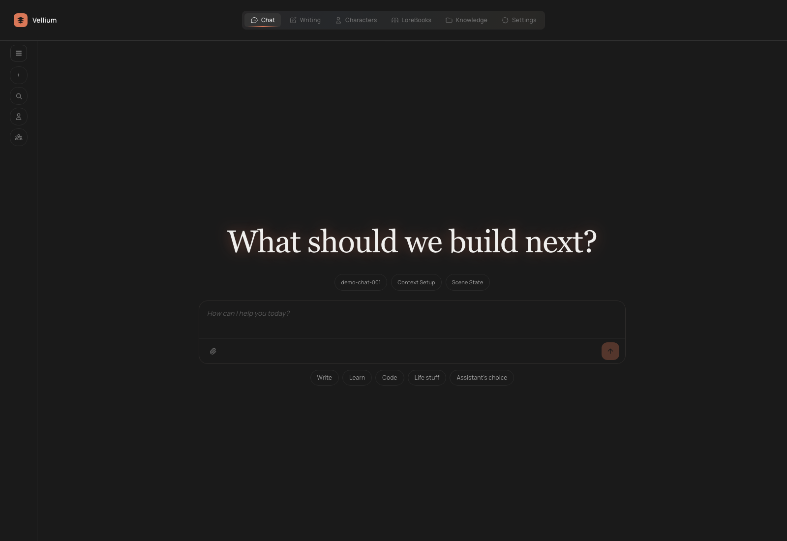
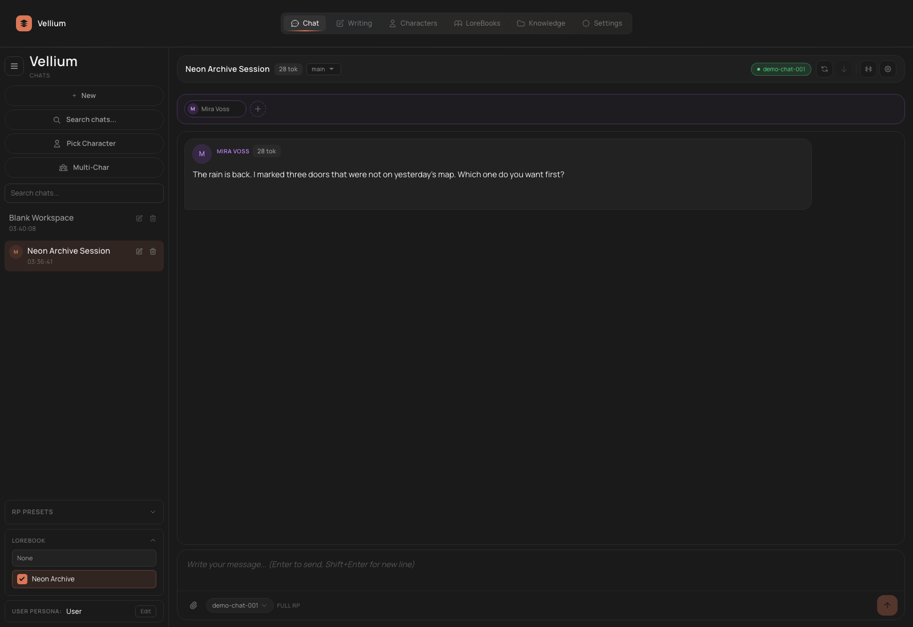

# Chat and RP

`Chat` is the central workspace in Vellium. It is where the active model, characters, LoreBooks, knowledge collections, translation, TTS, tool calling, and RP modes all meet.

The screenshots below use `Simple Mode`, because that is the cleanest first-run view for most users.

## What Chat Can Do

- normal assistant chats without a character
- single-character chats
- multi-character scenes
- branching history
- edit, resend, delete, and regenerate flows
- message translation
- TTS for messages
- attachments for vision and text context
- LoreBook and RAG integration
- MCP tool calling when the active provider supports it

## Basic Workflow

1. Open `Chat`.
2. Start a new chat.
3. Decide whether you need a character:
   - no character: normal assistant flow
   - one character: character-driven dialog or RP
   - multiple characters: scene-driven RP
4. Send the first message.
5. Adjust the right-side inspector or the Simple Mode controls only if you actually need them.

## Starting a New Chat

You can begin in several ways:

- a normal new chat
- a chat with a selected character
- a multi-character chat
- no explicit chat at all, where the first message creates the chat automatically

The chat screen also supports search, renaming, and deletion.

## Character Modes

### Chat without a character

Use it for:

- normal assistant requests
- coding / help / productivity questions
- short, direct conversations

### Chat with one character

Use it when you need:

- roleplay
- a character with its own `greeting`, `description`, `personality`, and `system prompt`
- a conversation whose behavior is defined by a character card

### Multi-character chat

Vellium can hold several characters inside one scene. In multi-character mode you can:

- assemble multiple characters in one chat
- change their order
- remove characters from the scene
- run auto-conversation
- hand the next turn to a specific character manually

This is especially useful for RP groups, dialogue-heavy scenes, and worldbuilding sessions.

## Message Management

For messages and branches Vellium supports:

- `Regenerate`
- `Edit`
- `Delete`
- `Resend`
- `Fork`

Practical meaning:

- `Edit` is useful when you want to preserve the conversation structure but fix context
- `Regenerate` is useful when the logic is fine but the answer quality is not
- `Fork` is useful when you want to keep a canon branch and still test alternatives

## Personas

`Persona` is a separate entity that describes the user as a participant in the scene or conversation.

A persona is useful when you want to:

- keep a stable user name
- describe the user's tone, behavior, or role
- switch quickly between several user identities

This matters most in RP or in long-running character-driven chats.

## Inspector and RP Control

The inspector controls the hidden context and RP parameters of the chat. Typical controls include:

- `Author's Note`
- `Scene State`
- sampler settings
- `Prompt Stack`
- `Compressed Context`
- the `System Prompt` used in pure-chat mode

### Chat Mode

Vellium supports several behavior profiles:

- `Full RP`
- `Light RP`
- `Pure Chat`

`Pure Chat` removes hidden RP injections and relies only on the explicit system prompt. It is useful for weak models or for normal assistant use.

`Light RP` keeps some RP control but simplifies the pipeline.

`Full RP` is the richest mode and is meant for heavier roleplay context.

## Scene Controls

The scene can include built-in and custom controls such as:

- dialogue style
- initiative
- descriptiveness
- unpredictability
- emotional depth
- custom sliders or toggles

These controls are useful when you want to shape not only what is said, but how the scene is generated.

## LoreBook and RAG in Chat

### LoreBook

LoreBook is the scripted / world-info layer. Use it for:

- world facts
- terms
- setting rules
- keyword-triggered context

It does not replace RAG. It solves a different problem.

### RAG

RAG is for retrieval from knowledge collections:

- semantic retrieval
- top-k retrieval
- optional reranker passes

In Chat you can enable RAG and choose which collections are attached to the active chat.

## Attachments

The chat supports at least two practical attachment types:

- images for vision-capable scenarios
- text files for extra context and knowledge-oriented flows

Compatible attachments also have preview support.

## Translation and TTS

Inside the chat you can:

- translate messages
- show translation next to the original or replace the original visually
- generate TTS audio for messages

This is useful for:

- bilingual reading
- writing RP in one language and reading output in another
- listening back to drafts or assistant answers

## Tool Calling and MCP

If `Tool Calling` is enabled in `Settings` and MCP servers are configured, the model can call tools during generation.

Important:

- this works only with OpenAI-compatible chat/completions providers
- tool calling is disabled for KoboldCpp
- the available functions are managed in `Settings -> Tools & MCP`

Inside the chat, tool calls and tool results appear as part of the response flow.

## When Simple Mode is the better choice

Simple Mode is a strong default if you:

- want a cleaner visual flow
- do not want advanced side panels open all the time
- use chat as your main entry point into the app

## When to move back to the advanced flow

Stay in the fuller layout if you need:

- branch-heavy experiments
- manual prompt stack work
- scene state tuning
- custom scene controls
- sampler debugging
- heavy MCP and tool-calling inspection

## Practical Advice

- First get stable generation without a character, then add RP layers.
- For RP longer than a few messages, set up both a character card and a persona early.
- If responses become noisy, try `Pure Chat` or `Light RP`.
- If the model forgets facts, first decide whether the problem belongs to LoreBook or RAG. They are different mechanisms.
- Multi-character chat is powerful, but it expands context quickly. Watch your compression flow and context window.
