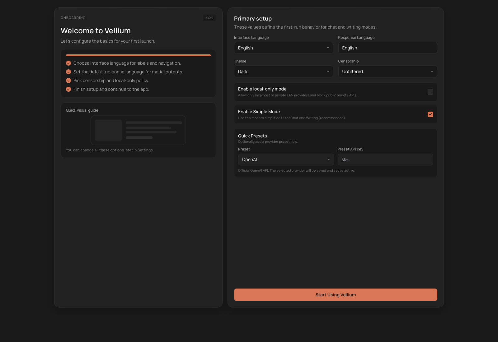

# Getting Started

This section is for the first launch of Vellium and the first working setup that lets you safely move on to chat, writing, and RAG workflows.

## Who This Section Is For

- A user opening Vellium for the first time
- A developer running the project from the repository
- A power user who wants a local backend up quickly without drowning in settings

## Launch Options

### 1. Use an already built desktop app

If you already have a packaged build of Vellium, launch the app and move straight to `First launch and the Welcome screen`.

### 2. Run locally from the repository

Minimal development flow:

```bash
npm install
npm run dev
```

This starts the frontend and the local API. By default the frontend is available at `http://localhost:1420`.

If you specifically need the Electron desktop shell, use:

```bash
npm run dev:electron
```

### 3. Build a desktop package

To package locally:

```bash
npm run dist
```

Platform-specific variants:

```bash
npm run dist:mac
npm run dist:linux
npm run dist:win
```

## First Launch and the Welcome Screen

On first launch Vellium shows an onboarding screen. This is where you define the app's baseline behavior:

- `Interface Language` for labels and navigation
- `Response Language` for model output defaults
- `Theme`
- `Censorship`
- `Enable local-only mode`
- `Enable Simple Mode` for the simplified `Chat` and `Writing` UI
- `Quick Presets` for creating a provider profile immediately



### What to choose on day one

If you are unsure:

- interface language: `en` or whatever you navigate fastest in
- response language: the language you actually write in most often
- theme: whatever matches your daily workflow
- censorship: your own usage policy
- local-only mode: enable it if you only use local models or self-hosted endpoints
- simple mode: usually keep it enabled first

## Built-In Provider Presets

Vellium can create a provider profile quickly from either `Welcome` or later in `Settings`.

| Preset | When to choose it | Type |
| --- | --- | --- |
| `OpenAI` | You use the official OpenAI API | OpenAI-compatible |
| `LM Studio` | You run a local model through LM Studio | OpenAI-compatible, local |
| `Ollama` | You use Ollama's OpenAI-compatible endpoint | OpenAI-compatible, local |
| `KoboldCpp` | You run an RP-heavy local stack with KoboldCpp | KoboldCpp |
| `OpenRouter` | You want a unified model catalog through OpenRouter | OpenAI-compatible |
| `Custom` | You use another compatible API that the presets do not cover | OpenAI-compatible |

## Minimal Working Setup

Opening the app is not enough. Vellium needs a working provider profile and an active model before the main workflows become useful.

Do this in order:

1. Open `Settings`.
2. Choose a preset or fill a provider manually.
3. Save the provider profile.
4. Load models.
5. Choose the `active provider` and `active model`.
6. Go back to `Chat` and send a test message.

If the active model is missing, the chat UI will tell you directly.

## First Useful Smoke Test

If your goal is only to confirm that the app works:

1. Start Vellium.
2. In `Settings`, choose `OpenAI`, `LM Studio`, `Ollama`, or `KoboldCpp`.
3. Assign an active model.
4. Open `Chat`.
5. Start a new chat without a character.
6. Send a short prompt.
7. Only after that add characters, LoreBooks, or RAG.

## When to enable local-only mode immediately

`Local-only mode` is useful if you:

- only use LM Studio, Ollama, KoboldCpp, or private LAN endpoints
- want to prevent accidental requests to public APIs
- test Vellium in a fully local environment

Do not enable it if you plan to use public endpoints such as OpenAI or OpenRouter.

## When to enable Simple Mode immediately

`Simple Mode` is worth enabling if:

- you want a cleaner, more modern Chat and Writing UI
- you want to learn the main flows before dealing with every advanced side panel
- the app will be used by non-technical users as well

You can change it later in `Settings`.

## What to verify in the first 10 minutes

- The app opens without startup errors
- `Settings` saves a provider profile
- The model list loads
- `Chat` responds
- File attachments and basic Markdown rendering work
- If you need RAG, at least one knowledge collection can be created
- If you need RP, at least one character can be imported

## What to read next

- For chat and RP: [chat-and-rp.md](./chat-and-rp.md)
- For characters and world info: [characters-and-lorebooks.md](./characters-and-lorebooks.md)
- For writer workflows: [writing.md](./writing.md)
- For providers and advanced settings: [settings-and-providers.md](./settings-and-providers.md)
