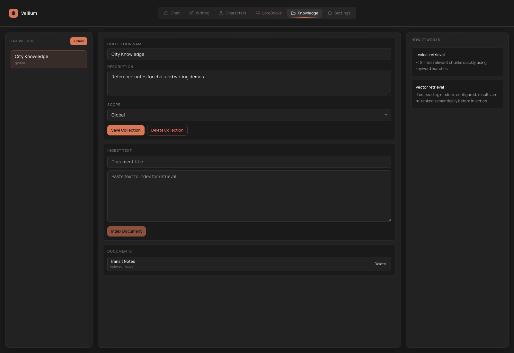

# Knowledge and RAG

`Knowledge` is Vellium's retrieval layer: collections, documents, and the later use of those documents in `Chat` and `Writing`.

## When Knowledge is the right tool

Use `Knowledge` when you need to:

- store reference text outside the live chat or manuscript
- use retrieval by meaning instead of strict trigger keys
- give the model access to research notes, canon, documentation, or world notes

If you need keyword-triggered prompt injection, that is usually a `LoreBook` job instead.

## Main entities

| Entity | Meaning |
| --- | --- |
| `Collection` | A knowledge container |
| `Document` | One text item inside a collection |
| `Scope` | Which workflow the collection is meant for |

## Collection scope

Each collection in Vellium has a scope:

- `global`
- `chat`
- `writer`

### How to use that in practice

`global`

- shared knowledge that may be needed across the app

`chat`

- collections optimized for dialogue, RP, and assistant-style flows

`writer`

- references, world notes, and research material for writing workflows

## Basic workflow

1. Open `Knowledge`.
2. Create a new collection.
3. Set its name, description, and scope.
4. Enter the `Document title`.
5. Paste the document text.
6. Run ingestion.
7. Attach the collection in `Chat` or `Writing`.

## How ingestion works

The current `Knowledge` UI is built around manual text input:

- a document title
- a main body of text

That makes collections convenient for:

- research notes
- canon sheets
- compact reference docs
- curated fragments of useful knowledge

## Connecting RAG in Chat

In `Chat` you can:

- enable `Use RAG`
- choose the attached knowledge collections
- tune retrieval behavior if the current mode exposes those controls

RAG is useful in chat when the model needs to:

- recall facts from external text
- answer using documentation
- keep a large reference base outside the direct prompt

## Connecting RAG in Writing

In `Writing`, RAG is useful when the project depends on:

- a world with many rules
- historical or technical references
- canon databases
- research notes

The big advantage is separation: the manuscript and the knowledge base remain distinct.

## What `Settings` controls for RAG

`Settings` has dedicated RAG blocks for:

- the embedding model
- an optional reranker
- retrieval tuning
- top-k
- candidate pool size
- similarity threshold
- max context tokens
- chunk size
- chunk overlap

## Reranker

Vellium supports optional cross-encoder reranking through an OpenAI-compatible `/rerank` endpoint.

Use it when:

- retrieval works, but candidate ordering is weak
- you need more accurate ranking
- the knowledge base is large enough that ranking quality matters

## When to choose LoreBook vs RAG

Choose `LoreBook` if:

- you need strict keyword logic
- context must fire from explicit triggers
- your RP or world info is organized around terms and keys

Choose `Knowledge / RAG` if:

- you need semantic retrieval
- the knowledge set is too large for manual trigger management
- you work with research or reference corpora

In many workflows both mechanisms work well together, but they solve different problems.

## Practical Recommendations

- Split knowledge into thematic collections instead of one giant bucket.
- Keep documents compact and explicit.
- If retrieval feels noisy, reduce collection noise before turning every numerical knob.
- For writing projects, it is often smart to keep canon and research in separate scopes or separate collections.
