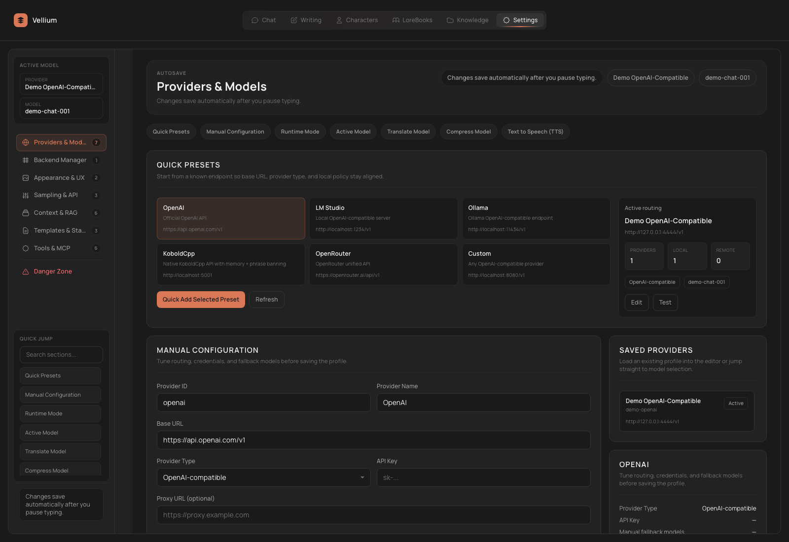

# Settings and Providers

`Settings` in Vellium is not just a preferences page. It is the routing center for models, UI behavior, context policies, security policies, plugins, and MCP.

## Settings categories

Vellium groups settings into large categories:

| Category | What is inside |
| --- | --- |
| `Connection` | Providers, active model, translation/compress/TTS routing |
| `Backends` | Managed local backends |
| `Interface` | UI language, themes, density, Simple Mode, general UX |
| `Generation` | Output behavior, sampler defaults, API parameter forwarding |
| `Context` | Context window, scene fields, chat behavior, RAG tuning |
| `Prompts` | Prompt templates, prompt stack, default system prompts |
| `Tools & MCP` | Tool calling, security, plugins, MCP servers, MCP functions, reset flows |

## Connection: providers and models

### Quick presets

From both `Settings` and `Welcome`, you can create a provider profile from a preset:

- `OpenAI`
- `LM Studio`
- `Ollama`
- `KoboldCpp`
- `OpenRouter`
- `Custom`

### Manual provider setup

If no preset fits, configure the provider manually. Typical fields include:

- provider ID
- display name
- base URL
- API key
- provider type
- local-only flag
- manual fallback models

### Provider types

Vellium distinguishes between:

- `OpenAI-compatible`
- `KoboldCpp`
- `Custom adapter`

That matters because not every feature behaves the same across all provider types.

### Active model routing

`Settings` does not only store provider profiles. It also stores the active model used by `Chat` right now.

If the active model is not assigned, the main flows are incomplete.

## Separate models for separate jobs

Vellium can keep separate models or providers for:

- translation
- context compression
- TTS
- embeddings / RAG
- reranking

This is one of the biggest advantages of Vellium as a workbench: one endpoint does not have to do everything.

## Runtime mode and local-only policy

Through runtime mode and local-only restrictions you can control whether the app allows:

- localhost-only endpoints
- private LAN endpoints
- external remote endpoints

This matters most in private, local, or self-hosted deployments.

## Backends

The `Backends` section exists for users who want Vellium to help manage locally launched backend processes.

From the code and UI structure, this section is built around:

- managed backends
- imported CLI commands
- runtime state
- logs

Use it when your self-hosted stack is complex enough that you want launch control close to the app.

## Interface

The `Interface` section usually contains:

- interface language
- response language
- theme
- plugin theme
- Simple Mode / workspace mode

If several people use Vellium on the same machine, it is worth defining these early.

## Generation

This section holds the settings that affect output style and form:

- output behavior
- sampler defaults
- API parameter forwarding

The `API param forwarding` block is especially important, because it controls which generation parameters are actually sent to the backend.

## Context

The `Context` section affects long chats and RP more than almost anything else:

- context window size
- conversation behavior
- scene field visibility
- RAG routing
- reranker routing
- retrieval tuning

If long conversations become unstable, this is one of the first places to inspect.

## Prompts

This section controls the system layer of generation:

- prompt templates
- prompt stack
- default system prompts

The Vellium prompt stack uses blocks such as:

- `system`
- `jailbreak`
- `character`
- `author_note`
- `lore`
- `scene`
- `history`

This is the key section for users who tune RP deeply or want strict prompt structure control.

## Tools and MCP

### Tool calling

Inside `Tools & MCP` you can:

- enable `Tool Calling`
- choose the policy: `Conservative`, `Balanced`, or `Aggressive`
- set the per-turn call limit
- enable `Auto-attach MCP tools`

Important:

- tool calling is disabled for `KoboldCpp`
- it can be enabled for OpenAI-compatible providers

### Security

The security block controls at least:

- Markdown HTML sanitization
- external link policy
- remote image policy
- unsafe upload policy

This directly affects how Vellium renders model-generated Markdown and handles external resources.

### Plugins

From `Settings -> Plugins` you can:

- install a plugin from `Pluginfile`
- export a plugin back into `Pluginfile`
- reload the catalog
- copy the plugins directory path
- open plugin settings
- manage permissions
- enable or disable plugins

### MCP Functions

This block is where Vellium:

- loads function definitions from configured MCP servers
- groups them by server
- lets you disable individual callable functions

### MCP Servers

For each MCP server you can configure:

- `Server ID`
- `Display Name`
- `Command`
- `Arguments`
- `Environment`
- `Enabled`
- `Timeout`

You can also:

- import server definitions from URL or JSON
- test a server
- save it
- delete it

## Danger Zone

`Danger Zone` contains the full settings reset.

Use it only when:

- the configuration is clearly stuck
- you want to restart setup from a clean baseline
- you need to discard experimental state quickly

## Recommended setup profiles

### Local RP stack

- provider: `LM Studio`, `Ollama`, or `KoboldCpp`
- local-only: enabled
- Simple Mode: personal preference
- RAG: only if you actually use collections
- tool calling: only if you need it and the provider supports it

### General remote stack

- provider: `OpenAI` or `OpenRouter`
- local-only: disabled
- translation / compression / TTS can be split across separate models
- enable tool calling only after MCP is configured

### Writing stack

- one writer-friendly generation model
- a separate compression model
- a separate embedding model
- Book Bible + knowledge collections + summary lenses

## Practical Advice

- Do not try to configure every section at once. Start with `Connection`, then `Context`, then `Prompts`.
- If you change backend infrastructure, always re-check the active model.
- If prompt behavior breaks after experiments, restore prompt defaults before switching providers.
- Plugins and MCP are safer to enable only after the base chat flow is already stable.
