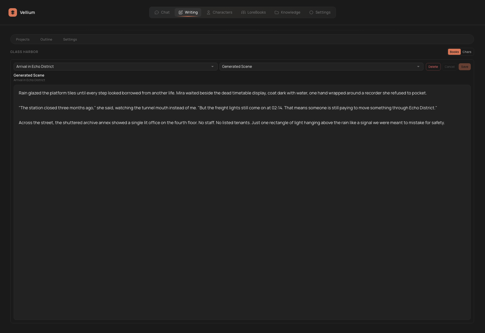

# Writing

`Writing` in Vellium is a dedicated workspace for long-form text, books, scenes, and writing-specific AI flows. It is not just another chat window.

The screenshot below shows the `Simple Mode` writing workspace, which is the cleaner option for first-time use.

## What Writing Covers

- book projects
- chapters and scenes
- next-chapter generation
- rewrite / expand / summarize flows
- consistency checks
- a Book Bible
- writer-side RAG
- Character Forge
- summary lenses
- DOCX import and DOCX / Markdown export

## Main Entities

| Entity | What it means |
| --- | --- |
| `Project` | A separate book or writing project |
| `Chapter` | A chapter or major structural block |
| `Scene` | A scene inside a chapter |
| `Book Bible` | Structured notes for the whole project |
| `Cast` | The set of related characters |
| `Lens` | An analysis template for summaries and diagnostics |

## Workspace Modes

Writing supports at least two meaningful modes:

- `Books`
- `Chars`

`Books` is for actual manuscript work: projects, chapters, scenes, and exports.

`Chars` is for Character Forge and character editing with a writing-first workflow.

## Basic Book Workflow

1. Create a new project.
2. Add the first chapter.
3. Create or generate the first scene.
4. Use `Expand`, `Rewrite`, `Summarize`, and `Consistency` while editing.
5. Keep the `Book Bible` updated so the project does not drift.
6. Export to Markdown or DOCX when needed.

## Projects, Chapters, and Scenes

In `Books`, Vellium lets you:

- create and rename projects
- delete books, chapters, and scenes
- search through books
- generate the next chapter
- edit scene text inline

That means Writing supports both AI generation and deliberate manual draft construction.

## Main Writer Operations

### Generate

Use it when you need a fresh scene draft or a continuation based on the current context.

### Generate Next Chapter

Use it when the book already has a structure and you want help moving from one major block to the next.

### Expand

Adds detail, transitions, and additional texture to an existing scene.

### Rewrite

Useful when the idea is right but the phrasing or tone is wrong.

### Summarize

Builds short summaries for scenes or the whole project, which helps navigation and context retention.

### Consistency

Runs continuity checks and helps surface contradictions inside the project.

## Chapter Dynamics

Each chapter can carry its own dynamics profile, including controls such as:

- `Tone`
- `POV`
- `Creativity`
- `Tension`
- `Detail`
- `Dialogue Share`

This is useful when you want a chapter to obey formal constraints instead of relying only on prompt wording.

## Book Bible

The Book Bible is the project's structured memory. It can hold:

- `Book premise / core hook`
- `Style guide`
- `World rules / canon constraints`
- `Character ledger / arcs`
- `Book summary`

For long projects this is one of the most important sections. If you are writing a novel, a serial, or a campaign-like story, fill it from the beginning.

## Summary Lenses

`Summary Lenses` are analytic templates that let you inspect the project from a focused angle.

Built-in examples include:

- `Character Arc`
- `Object Tracker`
- `Setting Evolution`
- `Timeline`
- `Theme Development`

Each lens can be:

- created
- loaded
- run
- deleted
- scoped

This is especially useful for larger manuscripts.

## Character Forge

In `Chars` mode Writing can:

- generate a new character from a description
- add characters to the cast
- edit a character through AI Edit
- work with both basic and advanced inputs

AI Edit is useful when you do not want to rebuild a character from scratch and only need targeted changes.

## Writer-Side RAG

Writing can use retrieval separately from chat. This is useful when you want to:

- keep world references outside the manuscript itself
- pull in research notes, references, or background material
- maintain a shared knowledge base for writing tasks only

The collections themselves live in `Knowledge`, while model routing lives in `Settings`.

## DOCX Import and Export

Writing supports:

- `Import DOCX`
- `Export MD`
- `Export DOCX`

On import, Vellium offers parsing modes such as:

- `Auto`
- `Chapter markers`
- `Heading lines / DOCX headings`
- `Single book`

That matters because incoming manuscripts can have very different structures.

## When to import DOCX as a new book

This mode is useful when:

- you are moving an existing manuscript into Vellium
- the source document should become its own project
- you do not want to merge the import into an already active book

## Logs, Tasks, and Diagnostics

Writing keeps track of:

- generation logs
- background tasks
- consistency issue lists

These are useful not only for history, but also for debugging your own workflow.

## Practical Advice

- For long projects, set up the `Book Bible` before leaning on generation.
- `Rewrite` and `Expand` work best when the scene already has a clear intent.
- `Summary Lenses` become much more useful after several chapters, not on page one.
- If the project depends on research, create a dedicated knowledge collection and enable writer-side RAG.
- DOCX import is easiest to verify on a clean project, where structure problems are more obvious.
